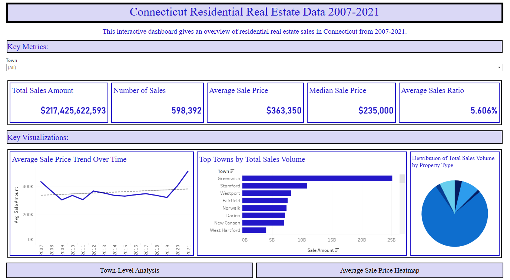

# Connecticut Residential Real Estate Analysis (2007-2021)

Analysis of Connecticut's residential real estate market using state sales records from 2007-2021.

## Interactive Dashboard
View the full interactive dashboard on [Tableau Public](https://public.tableau.com/app/profile/troy.ladka/viz/ConnecticutResidentialRealEstateData/ConnecticutRealEstateData2007-2020)

## Key Findings
- Total Sales Volume: $217.4B across 598,392 transactions
- Average Sale Price: $363,350
- Median Sale Price: $235,000
- Average Sales Ratio: 5.61%
- Greenwich leads in total sales volume, followed by Stamford and Westport
- Significant price increases observed in 2020-2021

## Visualizations

### Dashboard Overview

Main dashboard showing key metrics and trends, including total sales amount, number of sales, and average prices.

### Geographic Distribution

Heat map showing average sale prices across Connecticut towns, with larger circles indicating higher prices.

### Town-Level Analysis

Comparative analysis of town vs. state average prices over time, with property type distribution.

## Project Structure
```
project/
├── data/           # Contains raw CSV data (not tracked in git)
├── images/         # Dashboard screenshots
├── scripts/        # Python scripts for data processing
├── sql/           # SQL queries for data cleaning
└── README.md
```

## Data Source
[Connecticut Real Estate Sales 2001-2020](https://www.kaggle.com/datasets/utkarshx27/real-estate-sales-2001-2020-gl/data) from Kaggle

## Scripts
- `ct_re.py`: Loads CSV data into SQLite database
- `ct_re_for_tableau.py`: Exports cleaned data for Tableau visualization
- `ct_re_sql.sql`: SQL queries for data cleaning and transformation

## Data Cleaning Steps
1. Selected relevant columns: List Year, Date Recorded, Town, Address, Assessed Value, Sale Amount, Sales Ratio, Property Type
2. Filtered for residential properties only
3. Consolidated property types into a single column
4. Removed data prior to 2007 due to incomplete records
5. Removed outliers (sales over $20M in Willington)
6. Cleaned town names for mapping

## Setup
1. Install requirements:
```bash
pip install pandas sqlite3
```
